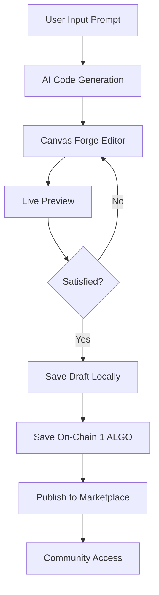
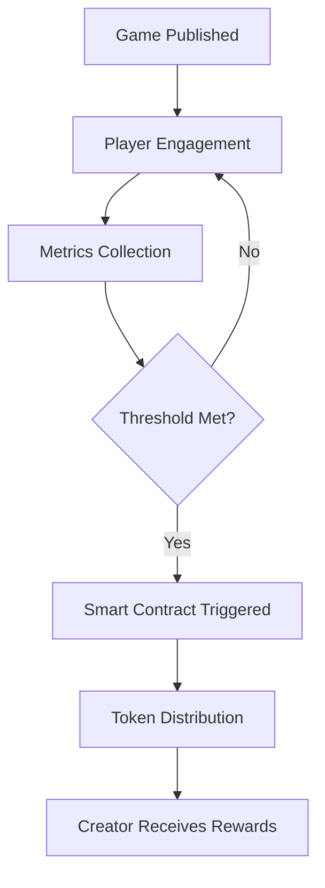

# Algo Game Hub

**Play. Create. Own** - The First AI-Powered Gaming Launchpad on Algorand

A decentralized peer-to-peer marketplace and gaming platform that enables seamless onboarding from Web2 to Web3 gaming through AI-powered game creation, on-chain publishing, and community-driven gameplay.

## Table of Contents

- [Overview](#overview)
- [Key Features](#key-features)
- [Architecture](#architecture)
- [Technology Stack](#technology-stack)
- [SDK Integration](#sdk-integration)
- [Getting Started](#getting-started)
- [API Documentation](#api-documentation)
- [Smart Contract Integration](#smart-contract-integration)
- [Monetization Model](#monetization-model)
- [Project Structure](#project-structure)
- [Development Workflow](#development-workflow)
- [Deployment](#deployment)
- [Screenshots](#screenshots)
- [Video Demonstrations](#video-demonstrations)
- [Contributing](#contributing)
- [License](#license)

## Overview

Algo Game Hub revolutionizes game development and distribution by combining artificial intelligence, blockchain technology, and community collaboration. Built on the Algorand blockchain, it provides a comprehensive ecosystem where users can:

- Generate games through AI prompts
- Edit and preview games in real-time
- Save games on-chain for 1 ALGO
- Publish to a decentralized marketplace
- Earn token rewards based on gameplay metrics
- Fork and build upon community creations

## Key Features

### AI-Powered Game Generation

- **Natural Language Processing**: Create games using simple text prompts
- **MCP Server Support**: Advanced AI capabilities for complex game logic
- **Code Generation**: Automated starter code creation via AI flows
- **Intelligent Refinement**: AI-assisted code optimization and debugging

### In-Browser Development Environment

- **Live Editor**: Real-time code editing with syntax highlighting
- **Instant Preview**: See changes immediately without compilation
- **Hot Reload**: Seamless development experience
- **Multi-format Support**: Compatible with various game frameworks

### Blockchain Integration

- **On-Chain Storage**: Secure game preservation on Algorand
- **Smart Contract Automation**: Automated publishing and monetization
- **Wallet Integration**: Seamless connection with Algorand wallets
- **Low Transaction Costs**: Affordable 1 ALGO publishing fee

### P2P Marketplace

- **Decentralized Distribution**: Direct creator-to-player transactions
- **Community Curation**: User-driven game discovery
- **Forking Mechanism**: Open-source collaboration model
- **Threshold-Based Rewards**: Creator compensation system

### Seamless Web2 to Web3 Onboarding

- **NPM SDK**: Easy integration for JavaScript developers
- **Go SDK**: Native support for Go applications
- **gRPC API**: High-performance cross-platform communication
- **Progressive Web App**: No-install gaming experience

## Architecture

```
┌─────────────────────────────────────────────────────────────┐
│                    Algo Game Hub Architecture                │
└─────────────────────────────────────────────────────────────┘

┌─────────────────┐    ┌─────────────────┐    ┌─────────────────┐
│   Frontend UI   │    │   AI Services   │    │  Blockchain     │
│                 │    │                 │    │  Layer          │
│ • Next.js       │    │ • MCP Server    │    │                 │
│ • TypeScript    │◄──►│ • AI Flows      │    │ • Algorand     │
│ • Tailwind CSS  │    │ • Code Gen      │    │ • Smart        │
│ • Shadcn UI     │    │ • Refinement    │    │   Contracts    │
└─────────────────┘    └─────────────────┘    │ • Wallet       │
         │                       │             │   Integration  │
         │                       │             └─────────────────┘
         ▼                       ▼                      ▲
┌─────────────────┐    ┌─────────────────┐             │
│   Game Engine   │    │   Backend API   │             │
│                 │    │                 │             │
│ • Canvas Forge  │    │ • REST APIs     │             │
│ • Live Preview  │◄──►│ • gRPC Server   │─────────────┘
│ • Hot Reload    │    │ • Authentication│
│ • Multi-format  │    │ • Game Logic    │
└─────────────────┘    └─────────────────┘
         │                       │
         │                       ▼
         │              ┌─────────────────┐
         │              │   Data Layer    │
         │              │                 │
         │              │ • MongoDB       │
         └──────────────│ • Game Storage  │
                        │ • User Profiles │
                        │ • Marketplace   │
                        └─────────────────┘

┌─────────────────────────────────────────────────────────────┐
│                      SDK Integration                        │
├─────────────────┬─────────────────┬─────────────────────────┤
│   NPM Package   │   Go Module     │      gRPC Services      │
│                 │                 │                         │
│ • JavaScript    │ • Native Go     │ • Cross-platform        │
│ • TypeScript    │ • High Performance │ • Language agnostic  │
│ • Easy Install  │ • Concurrent    │ • Scalable APIs        │
│ • Web2 Bridge   │ • Blockchain    │ • Real-time Updates    │
└─────────────────┴─────────────────┴─────────────────────────┘

┌─────────────────────────────────────────────────────────────┐
│                    Monetization Flow                        │
└─────────────────────────────────────────────────────────────┘

Game Creation → AI Generation → Save Draft → Publish (1 ALGO)
      │              │              │              │
      ▼              ▼              ▼              ▼
 Free Tier    AI Processing   Local Storage   On-Chain Storage
      │              │              │              │
      └──────────────┴──────────────┴──────────────┘
                                    │
                                    ▼
                          Marketplace Listing
                                    │
                                    ▼
                         Player Engagement Tracking
                                    │
                                    ▼
                    Threshold Reached? ──► Token Rewards to Creator
```

## Technology Stack

### Frontend

- **Framework**: Next.js 14 with App Router
- **Language**: TypeScript for type safety
- **Styling**: Tailwind CSS for responsive design
- **UI Components**: Shadcn UI with Radix primitives
- **State Management**: React Context and Zustand

### Backend

- **API**: REST endpoints with Next.js API routes
- **Database**: MongoDB for game storage and user data
- **Authentication**: JWT-based session management
- **Real-time**: WebSocket connections for live collaboration

### Blockchain

- **Network**: Algorand (Mainnet/Testnet/Localnet)
- **Wallet Integration**: @txnlab/use-wallet-react
- **Smart Contracts**: PyTeal for on-chain logic
- **Transaction Handling**: Algorand SDK

### AI Integration

- **MCP Server**: Model Context Protocol for advanced AI
- **Code Generation**: Custom AI flows for game creation
- **Natural Language Processing**: Prompt-based game generation

### Development Tools

- **Package Manager**: PNPM for efficient dependency management
- **Code Quality**: ESLint and Prettier
- **Type Checking**: TypeScript strict mode
- **Testing**: Jest and React Testing Library

## SDK Integration

### NPM SDK

Install the JavaScript/TypeScript SDK:

```bash
npm install @algogamehub/sdk
```

Basic usage:

```typescript
import { AlgoGameHub, GameConfig } from "@algogamehub/sdk";

const hub = new AlgoGameHub({
  network: "testnet",
  apiKey: "your-api-key",
});

// Create a game
const gameConfig: GameConfig = {
  title: "My First Game",
  description: "A simple puzzle game",
  aiPrompt: "Create a match-3 puzzle game with colorful gems",
};

const game = await hub.createGame(gameConfig);
await game.save(); // Save to chain for 1 ALGO
await game.publish(); // List on marketplace
```

### Go SDK

Install the Go module:

```bash
go get github.com/algogamehub/go-sdk
```

Basic usage:

```go
package main

import (
    "context"
    "github.com/algogamehub/go-sdk/client"
)

func main() {
    client := client.New(&client.Config{
        Network: "testnet",
        APIKey:  "your-api-key",
    })

    game, err := client.CreateGame(context.Background(), &client.GameRequest{
        Title:       "Go Game",
        Description: "Built with Go SDK",
        AIPrompt:    "Create a tower defense game",
    })
    if err != nil {
        panic(err)
    }

    // Save and publish
    err = client.SaveGame(context.Background(), game.ID)
    err = client.PublishGame(context.Background(), game.ID)
}
```

### gRPC Integration

The platform exposes gRPC services for high-performance integration:

```protobuf
service GameHubService {
  rpc CreateGame(CreateGameRequest) returns (GameResponse);
  rpc SaveGame(SaveGameRequest) returns (SaveGameResponse);
  rpc PublishGame(PublishGameRequest) returns (PublishGameResponse);
  rpc GetMarketplace(MarketplaceRequest) returns (MarketplaceResponse);
  rpc ForkGame(ForkGameRequest) returns (GameResponse);
}

message CreateGameRequest {
  string title = 1;
  string description = 2;
  string ai_prompt = 3;
  string user_id = 4;
}
```

## Getting Started

### Prerequisites

- Node.js 18+ and PNPM
- MongoDB instance (local or cloud)
- Algorand wallet (Pera, Defly, etc.)

### Installation

1. Clone the repository:

```bash
git clone https://github.com/yourusername/algo-game-hub.git
cd algo-game-hub
```

2. Install dependencies:

```bash
pnpm install
```

3. Configure environment variables:

Create `.env.local`:

```bash
# Database
MONGODB_URI="mongodb://localhost:27017/game-hub"

# Algorand Configuration
NEXT_PUBLIC_ALGOD_NETWORK="TESTNET"
NEXT_PUBLIC_ALGOD_TOKEN=""
NEXT_PUBLIC_ALGOD_SERVER="https://testnet-api.algonode.cloud"
NEXT_PUBLIC_ALGOD_PORT=""
NEXT_PUBLIC_INDEXER_SERVER="https://testnet-idx.algonode.cloud"

# AI Services
OPENAI_API_KEY="your-openai-key"
MCP_SERVER_URL="http://localhost:3001"

# Application
NEXTAUTH_SECRET="your-secret-key"
NEXTAUTH_URL="http://localhost:3000"

# gRPC Configuration
GRPC_SERVER_PORT=50051
GRPC_SERVER_HOST="localhost"
```

4. Start the development server:

```bash
pnpm dev
```

### Setting Up Algorand Wallet

1. Install a compatible wallet (Pera Wallet recommended)
2. Create or import an Algorand account
3. For testnet development, get test ALGO from the [Algorand Dispenser](https://testnet.algoexplorer.io/dispenser)
4. Connect your wallet through the platform interface

## API Documentation

### Game Management

#### Create Game

```http
POST /api/games/create
Content-Type: application/json

{
  "title": "Game Title",
  "description": "Game description",
  "aiPrompt": "Create a platformer game with jumping mechanics"
}
```

#### Save Game (On-Chain)

```http
POST /api/games/save
Content-Type: application/json

{
  "gameId": "game-uuid",
  "code": "game-source-code",
  "assets": ["asset1.png", "asset2.mp3"]
}
```

#### Publish to Marketplace

```http
POST /api/games/publish
Content-Type: application/json

{
  "gameId": "game-uuid",
  "price": 0,
  "category": "puzzle",
  "tags": ["casual", "mobile-friendly"]
}
```

#### Fork Game

```http
POST /api/games/fork
Content-Type: application/json

{
  "originalGameId": "source-game-uuid",
  "newTitle": "Forked Game Title"
}
```

### Marketplace

#### Get Published Games

```http
GET /api/marketplace?category=puzzle&limit=20&offset=0
```

#### Game Analytics

```http
GET /api/games/{gameId}/analytics
```

### Community

#### Get Community Games

```http
GET /api/community?sort=popular&timeframe=week
```

## Smart Contract Integration

### Game Registry Contract

The platform uses smart contracts for game registration and ownership:

```python
# smart_contracts/game_registry.py
from pyteal import *

def game_registry_contract():
    # Contract logic for game registration
    # Handles ownership, publishing fees, and revenue sharing
    return Seq([
        # Validation logic
        Assert(Txn.type_enum() == TxnType.ApplicationCall),
        Assert(Txn.application_args.length() >= Int(2)),

        # Game registration logic
        App.globalPut(Bytes("game_count"),
                     App.globalGet(Bytes("game_count")) + Int(1)),

        # Revenue sharing setup
        If(App.globalGet(Bytes("threshold_reached")) == Int(1),
           Seq([
               # Distribute tokens to creator
               InnerTxnBuilder.Begin(),
               InnerTxnBuilder.SetFields({
                   TxnField.type_enum: TxnType.AssetTransfer,
                   TxnField.asset_receiver: App.globalGet(Bytes("creator")),
                   TxnField.asset_amount: App.globalGet(Bytes("reward_amount"))
               }),
               InnerTxnBuilder.Submit()
           ])
        ),

        Approve()
    ])
```

### Revenue Sharing Logic

Games earn rewards when reaching engagement thresholds:

1. **Play Count Threshold**: Minimum number of unique players
2. **Time Spent Threshold**: Total gameplay hours across all players
3. **Rating Threshold**: Minimum community rating score

When thresholds are met, creators receive platform tokens proportional to engagement metrics.

## Monetization Model

### For Creators

- **Publishing Fee**: 1 ALGO to save game on-chain
- **Revenue Sharing**: Token rewards based on gameplay metrics
- **Premium Features**: Advanced AI tools and analytics

### For Players

- **Free-to-Play**: Access to all published games
- **Optional Purchases**: In-game assets and premium content
- **Tournament Entry**: Paid competitive events

### For the Platform

- **Transaction Fees**: Small percentage of on-chain transactions
- **Premium Subscriptions**: Advanced creator tools
- **Marketplace Commission**: Fee from premium game sales

## Project Structure

```
algo-game-hub/
├── app/                          # Next.js app router
│   ├── editor/                   # Game editor pages
│   ├── marketplace/              # Marketplace interface
│   ├── community/                # Community features
│   ├── api/                      # API endpoints
│   │   ├── games/               # Game management APIs
│   │   ├── marketplace/         # Marketplace APIs
│   │   ├── community/           # Community APIs
│   │   └── auth/                # Authentication
│   └── globals.css              # Global styles
├── components/                   # React components
│   ├── canvas-forge/            # Game editor components
│   ├── ui/                      # Shadcn UI components
│   ├── ConnectWallet.tsx        # Wallet connection
│   └── GamePreview.tsx          # Game preview
├── lib/                         # Utility libraries
│   ├── db.ts                    # Database connection
│   ├── algorand.ts              # Blockchain utilities
│   ├── ai.ts                    # AI service integration
│   └── utils.ts                 # Helper functions
├── ai/                          # AI service files
│   ├── flows/                   # AI generation workflows
│   ├── prompts/                 # Prompt templates
│   └── mcp-server/              # MCP server implementation
├── smart_contracts/             # Algorand smart contracts
│   ├── game_registry.py         # Main registry contract
│   ├── revenue_sharing.py       # Monetization logic
│   └── deploy.py                # Deployment scripts
├── contracts/                   # Additional contract logic
├── sdk/                         # SDK implementations
│   ├── npm/                     # NPM package source
│   ├── go/                      # Go module source
│   └── grpc/                    # gRPC service definitions
├── docs/                        # Documentation
├── tests/                       # Test suites
└── public/                      # Static assets
```

## Development Workflow

### 1. Game Creation Flow



### 2. Revenue Generation Flow



### 3. Development Commands

```bash
# Development
pnpm dev              # Start development server
pnpm build            # Build production bundle
pnpm start            # Start production server
pnpm lint             # Run ESLint
pnpm type-check       # TypeScript type checking

# Testing
pnpm test             # Run test suite
pnpm test:watch       # Watch mode testing
pnpm test:coverage    # Generate coverage report

# Database
pnpm db:migrate       # Run database migrations
pnpm db:seed          # Seed development data

# Smart Contracts
pnpm contracts:build  # Compile smart contracts
pnpm contracts:deploy # Deploy to selected network
pnpm contracts:test   # Run contract tests

# SDK
pnpm sdk:build        # Build all SDK packages
pnpm sdk:publish      # Publish to registries
```

## Deployment

### Production Deployment

1. **Environment Setup**:

```bash
# Production environment variables
MONGODB_URI="your-production-mongodb-uri"
NEXT_PUBLIC_ALGOD_NETWORK="MAINNET"
NEXTAUTH_URL="https://yourdomain.com"
```

2. **Build and Deploy**:

```bash
pnpm build
pnpm start
```

3. **Smart Contract Deployment**:

```bash
cd smart_contracts
python deploy.py --network mainnet
```

### Docker Deployment

```dockerfile
FROM node:18-alpine

WORKDIR /app
COPY package.json pnpm-lock.yaml ./
RUN npm install -g pnpm && pnpm install --frozen-lockfile

COPY . .
RUN pnpm build

EXPOSE 3000
CMD ["pnpm", "start"]
```

### Kubernetes Deployment

```yaml
apiVersion: apps/v1
kind: Deployment
metadata:
  name: algo-game-hub
spec:
  replicas: 3
  selector:
    matchLabels:
      app: algo-game-hub
  template:
    metadata:
      labels:
        app: algo-game-hub
    spec:
      containers:
        - name: app
          image: algogamehub/platform:latest
          ports:
            - containerPort: 3000
          env:
            - name: MONGODB_URI
              valueFrom:
                secretKeyRef:
                  name: app-secrets
                  key: mongodb-uri
```

## Screenshots

### Game Creation Interface

_Insert screenshot of the AI-powered game creation interface_

### Canvas Forge Editor

_Insert screenshot of the in-browser game editor with live preview_

### Marketplace

_Insert screenshot of the game marketplace with published games_

### Wallet Integration

_Insert screenshot of Algorand wallet connection interface_

### Community Dashboard

_Insert screenshot of the community features and forking interface_

## Video Demonstrations

### 1. Complete Game Creation Workflow

_Insert link to video showing: AI prompt → game generation → editing → publishing_

### 2. Marketplace Interaction

_Insert link to video showing: browsing games → playing → forking process_

### 3. SDK Integration Tutorial

_Insert link to video showing: NPM/Go SDK setup → API integration → deployment_

### 4. Smart Contract Interaction

_Insert link to video showing: wallet connection → on-chain saving → revenue sharing_

## Contributing

We welcome contributions from the community! Please follow these guidelines:

### Development Setup

1. Fork the repository
2. Create a feature branch: `git checkout -b feature-name`
3. Follow the coding standards and add tests
4. Submit a pull request with detailed description

### Code Standards

- Use TypeScript for type safety
- Follow ESLint configuration
- Write comprehensive tests
- Document new features
- Maintain backward compatibility

### Issue Reporting

Please use the GitHub issue tracker for:

- Bug reports with reproduction steps
- Feature requests with detailed specifications
- Documentation improvements
- Performance optimizations

## License

This project is licensed under the MIT License - see the [LICENSE](LICENSE) file for details.

---

**Algo Game Hub** - Bridging Web2 and Web3 Gaming Through AI Innovation

For support and questions, please visit our [Discord community](https://discord.gg/algogamehub) or contact us at support@algogamehub.com.
